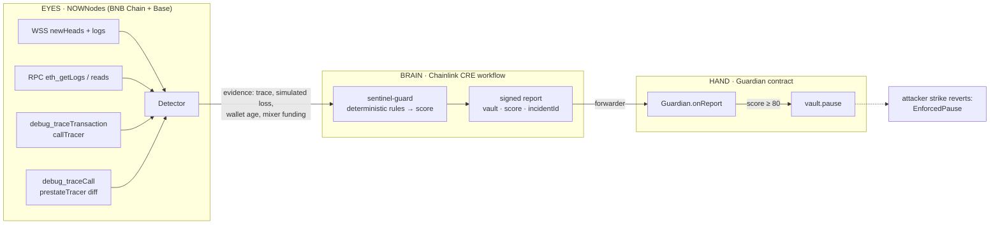

# SENTINEL: the airbag of DeFi

> You don't call the airbag during the crash. It fires on its own.

Every big DeFi exploit has a rehearsal: the attacker funds a fresh wallet, deploys an exploit contract, sends a **small test transaction**, and only then sends the real strike. SENTINEL watches for that test, simulates what the strike would do, and **pauses the vault before the strike lands**. The decision is made by a **Chainlink CRE** workflow, not by one server, and the on-chain responder can only do one thing: pause.

### 🌐 Live demo: [www.sentinel-defi.xyz](https://www.sentinel-defi.xyz) (public, read-only)
### ▶ [Watch the 3-minute demo (recorded live on BNB Chain mainnet)](https://drive.google.com/file/d/1MaewP4XTpBDA78kOE4kt85nXGQ5llXms/view?usp=sharing)

Built at **TOKEN2049 Singapore, Origins Hackathon** (Chainlink CRE track · NOWNodes track) by Team USquare.

---

## Live result on BNB Chain mainnet (6 Oct 2026)

| Step | Block | Transaction |
|---|---|---|
| Attacker's probe (re-entrant test, takes 0.0005 BNB) | 126,072,959 | [block](https://bscscan.com/block/126072959) |
| CRE report delivered → `Guardian` → `vault.pause()` | 126,073,004 | [0x4121c62e…bb84a](https://bscscan.com/tx/0x4121c62ed7b0d2190b425c22c836ba9eca51d6167196c8dbc851682843abb84a) (logs: `Paused`, `ExploitBlocked`, score 96) |
| Attacker's strike: **reverted, `EnforcedPause()`** | 126,073,064 | [0x7a38402d…07e92](https://bscscan.com/tx/0x7a38402d4c9a12315b7a378d200b9ed619d655f90eedef452ae4833d73c07e92) |

- **Probe → pause: 20.0 s on-chain** (block timestamps).
- **CRE risk score: 96 / 100** (threshold 80).
- **Simulated loss if the strike had landed: 89% of the vault.**
- **Lost to the strike: 0 BNB.**

---

## How it works: Eyes, Brain, Hand



### Eyes: NOWNodes
Every chain read goes through NOWNodes endpoints (`backend/src/config/chains.ts`, `api-key` header):
1. **WebSockets** (`wss://bsc.nownodes.io/wss`, `wss://base.nownodes.io/wss`): `newHeads` and `logs` subscriptions follow every protected vault, the Guardian and known mixer contracts in real time (`backend/src/warroom/heads.ts`, `backend/src/watchers/`). The War Room shows live block heights and NOWNodes round-trip time.
2. **RPC**: `eth_getLogs` scans on a 1.5 s cursor, plus block, receipt and nonce reads. **Wallet forensics** (wallet age, gas funded through a mixer) come from `eth_getLogs` on mixer `Withdrawal` events (`backend/src/detector/wallet.ts`).
3. **Debug and trace RPC** (`backend/src/detector/investigate.ts`):
   - `debug_traceTransaction` with `callTracer` on the probe, which finds `withdrawAll()` re-entered inside itself;
   - `debug_traceCall` with `prestateTracer` (`diffMode`), which **simulates the attacker's strike** and measures the vault's loss before it is sent.
4. **Chainlink price feeds read through NOWNodes RPC** (`latestRoundData`) price the value at risk in USD (`backend/src/prices.ts`).

### Brain: Chainlink CRE
`cre/sentinel-guard/` is a TypeScript → WASM CRE workflow with an HTTP trigger:
- It receives the evidence and scores it with deterministic rules: re-entry in the trace **+30**, simulated loss ≥ 20% **+30**, mixer-funded gas **+20**, wallet < 1 h old **+16**, and more. The pause threshold is **80**.
- A **hard guard** blocks any pause without a hard signal plus ≥ 5% simulated loss.
- It ABI-encodes and signs a report `(vault, score, incidentId)` and writes it to the Guardian through the forwarder.
- It logs `SENTINEL_VERDICT {…}` and `SENTINEL_REPORT {…}` lines for the backend and the War Room.

### Hand: Guardian contract
`contracts/src/Guardian.sol` (inherits Chainlink `ReceiverTemplate`):
- It accepts reports only from the forwarder, checks that the vault is registered and that the score is ≥ 80, then calls `pause()`.
- It **cannot** unpause, move funds, upgrade the vault or change roles. The protocol admin keeps those powers.
- **Onboarding a live protocol takes two transactions:** `grantRole(PAUSER_ROLE, guardian)` and `Guardian.registerVault(vault)`.

---

## Deployments

| | BNB Chain (56) | Base (8453) |
|---|---|---|
| Vault (demo) | [`0x82979c77…609b3`](https://bscscan.com/address/0x82979c777506D979B365Ce597c1F595251B609b3) | `0x8B658C17CcD1E9dF830A70637a57D8449B3e2D29` |
| Guardian | [`0x4Ab9F9cD…45748`](https://bscscan.com/address/0x4Ab9F9cD8B5394Bece5b448dbebdC00E52C45748) | `0x3DaF8728624949179E0C62BDE12286f7EB900186` |
| Forwarder (mock, hackathon) | `0x6f3239bbB26e98961e1115aBa83f8a282e5508C8` | `0x5E342a8438B4f5d39e72875FCee6f76B39CCE548` |
| MockMixer (demo) | `0x89CBF3bfB3943274271635aa887A467DaDc6077E` | `0xc3ca2E33468D23538Ea7E0a63048135a5Af303D6` |

Full addresses and deploy transactions: `contracts/deployments/56.json`, `contracts/deployments/8453.json`.

---

## Repository layout

```
contracts/   Foundry: Guardian, VulnerableVault (demo), Attacker (demo), MockMixer, tests, deploy scripts
cre/         Chainlink CRE project: sentinel-guard workflow, fixtures, simulation scripts
backend/     Node 20 + TypeScript: NOWNodes watchers, detector (trace + simulation), CRE bridge,
             War Room stage events (socket.io), REST API, Prisma/Postgres
frontend/    Next.js: dashboard, protocol onboarding, incidents, War Room, Attack Simulator
```

## Run it locally

Each folder has a `.env.example`. Copy it to `.env` and fill it in (NOWNodes key, Postgres URL, CRE path). **Keys are never committed.**

```bash
# contracts
cd contracts && forge build && forge test

# CRE workflow (CRE CLI installed)
cd cre && npm run sim:attack:bsc     # attack fixture → score 96 → PAUSE
cd cre && npm run sim:control        # normal withdrawal → rejected

# backend
cd backend && npm install && npm run db:migrate
npm run check:nownodes               # verifies NOWNodes RPC/WSS access
npm run check:cre                    # verifies the CRE CLI setup
npm run dev                          # API on :8787

# frontend
cd frontend && npm install && npm run dev   # http://localhost:3000
```

For the live demo, the CRE workflow runs in listen mode with on-chain broadcast:
```bash
cre workflow simulate sentinel-guard -T staging-settings --non-interactive --trigger-index 0 \
  --http-payload sentinel-guard/fixtures/control.json --broadcast --listen
```

## Hackathon vs production (honest notes)

- **Today:** CRE CLI simulation (single node) with `--broadcast` through a **mock forwarder**.
- **Production:** the same workflow deployed to a Chainlink **DON**, the real KeystoneForwarder, `setExpectedWorkflowId`, and a multisig owner. Same contracts, same workflow code: it's a configuration change, not a rewrite.
- **Out of scope:** one-shot single-transaction drains (no window to act in), attacks by whoever holds the unpause key, and off-chain hacks. Audits still matter.

## Beyond re-entrancy

Re-entrancy is what we showed live. It's the tip of the iceberg: oracle and price manipulation, flash-loan attacks, governance takeovers, malicious upgrades, infinite mints, approval drains, access-control exploits, bridge drains, copycat attacks and cross-chain spread all **test before they strike**. Each becomes a new rule in the same CRE workflow. Any protocol with a pause switch, existing or new, can plug in.

---

**Team USquare** · Ujjwal Bajaj, CEO, USquare Newtech Pvt Ltd. · Built with NOWNodes and Chainlink CRE.
